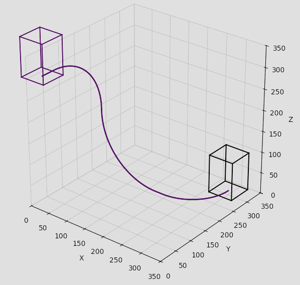

# Rounded path

Automatic rounded corners for fast non-printing moves.
Typical usage is a chain of move commands that need to be fast but can afford to not be fully accurate.  



# Configuration

```salt
[rounded_path]
resolution: 0.2 [1] # the length of a circle approximation segments.
replace_g0: True/False   [False] # Use at your own risk
algorithm: fillet/bezier [fillet] # algorithm for curves/path rounding
```

# Gcodes

`ROUNDED_G0 [X=<x>] [Y=<y>] [Z=<z>] [F=<f>] D=<distance>`: 
Moves the toolhead, same as regular G0/1.
The printer may omit reaching this position fully to optimize the travel to the 
next position. `Distance` is the maxiumum deflection distance from this point.

# Usage

Example usage:
```
ROUNDED_G0 Y=30 D=5 F=1000
ROUNDED_G0 X=100 D=30
ROUNDED_G0 Y=100 D=30
ROUNDED_G0 X=200 D=30
ROUNDED_G0 Y=200 D=30
ROUNDED_G0 X=100 Y=100 Z=10 D=0 
```
The rounded path chain **must always end with D=0** to allow computing the final move.

# Limitations
This currently only optimizes on segment by segment basis, 
practically rounding radius for each corner is limited by the shortest distance to previous/next point.
